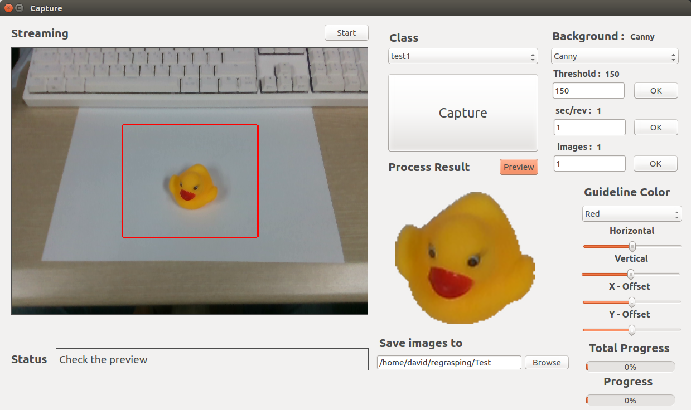

# Object Image Collecting Tool
A simple tool for collecting object images (without background). 

## Screenshot


## Note:
* Background removal can only be performed on simple backgrounds with single color.
* The background is removed using the threshold of pixel values or by the Canny algorithm.

## Requirement
* Python 2.7
* PyQt5
* cv_bridge
* json
* opencv-python

## Usage
1. Change ***config.json*** according to your configuration.
* CAMERA_TOPIC: your camera topic name on ROS
* CLASSES: Class list (object images are named according to this list.)
2. Run your camera node.
3. Run object image collecting tool

``` python object-image-collector.py ```

4. Press **start** button (Camera topic should be streamed to the screen).
5. Set the followings.
* Background
* Threshold
* sec/rev: Time for one turn of turntable (if you use a turntable, default=1)
* Images: Number of images to save per turn (if you use a turntable, default=1)
6. Set the path to save the image.
7. Select the class to collect images.
8. Adjust the threshold appropriately via the preview button.
9. Press **Capture** button.
